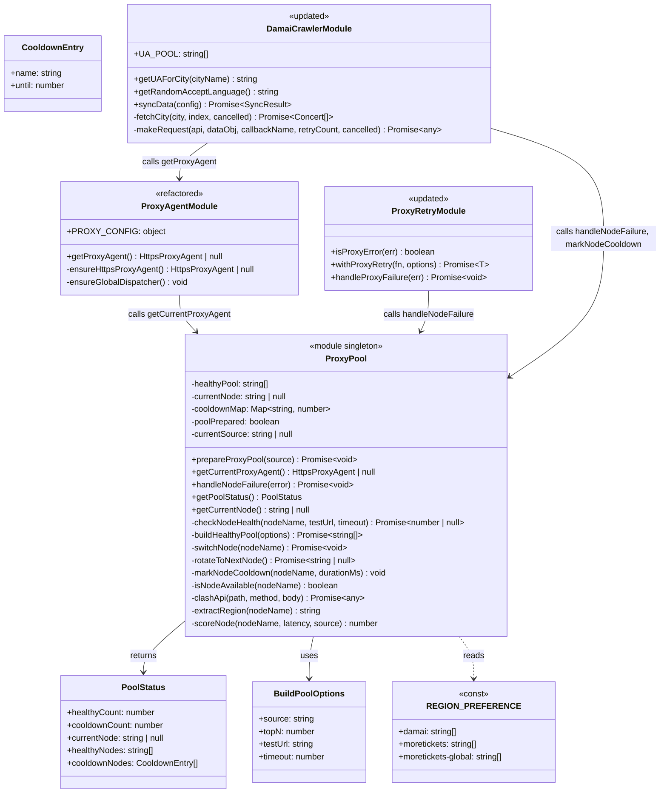
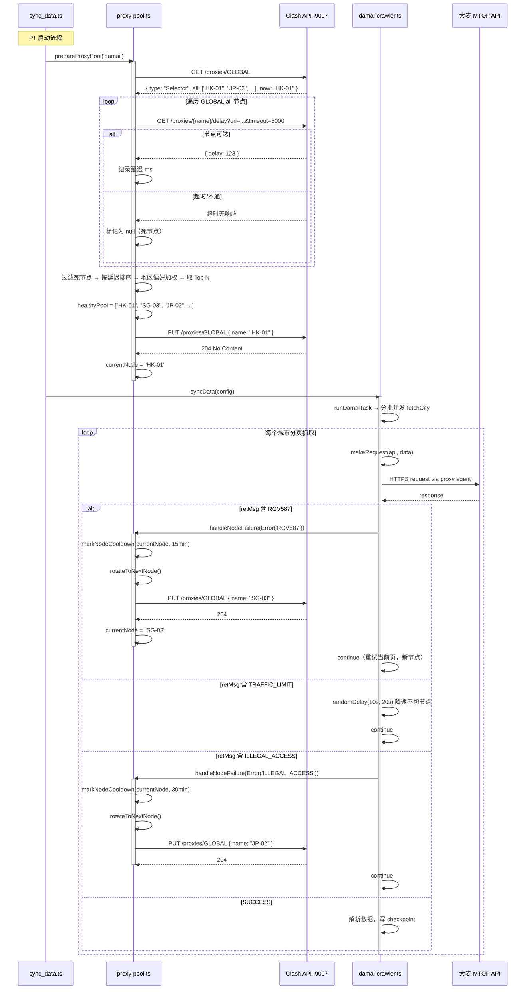
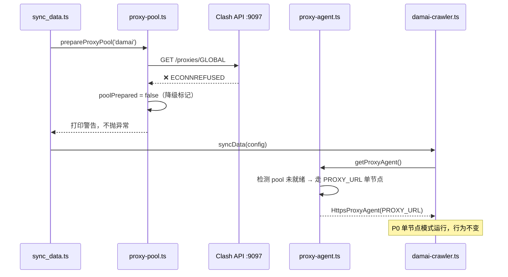
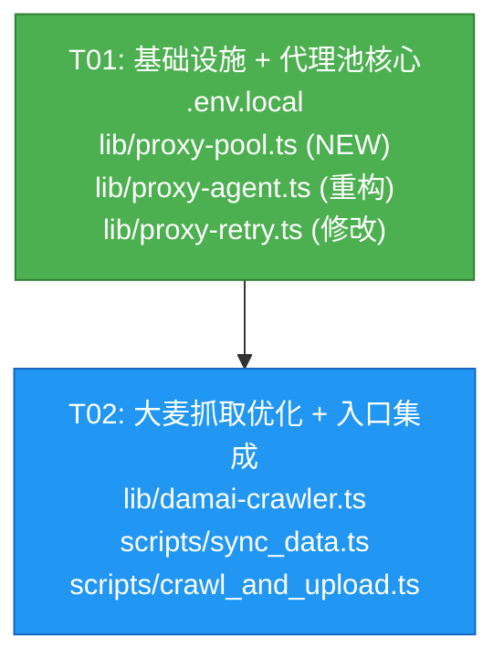

# P1 抓取侧优化 — 系统设计与任务分解

> Architect: Bob | Date: 2026-01-28 | Project: concert-calendar

---

## Part A: 系统设计

### 1. 实现方案

#### 1.1 核心技术挑战

| 挑战 | 分析 | 对策 |
|------|------|------|
| **代理节点健康检测** | 166 个 Clash 节点质量参差不齐，需在每次同步前筛选可用节点 | 调 Clash API `GET /proxies/{name}/delay` 逐节点测速，过滤超时/不通节点 |
| **风控自动切换** | 大麦 RGV587/ILLEGAL_ACCESS 触发后需自动换 IP，避免手动干预 | `handleNodeFailure` 联动 `rotateToNextNode` + `markNodeCooldown` |
| **冷却机制** | 被风控标记的节点短期内不应复用，否则加剧封禁 | `Map<string, number>` 内存冷却表，到期自动解禁 |
| **地区偏好** | 大麦/摩天轮移动端对非亚洲节点敏感，全球端无限制 | `REGION_PREFERENCE` 配置按 source 选节点，优先 HK/TW/SG/JP |
| **降级兼容** | Clash API 不可用时不能阻断同步 | `proxy-agent.ts` 保留 `PROXY_URL` 单节点 fallback，与 P0 行为一致 |

#### 1.2 框架与库选择

**不引入任何新依赖**。所有功能基于 Node.js 内置模块：

- `http` 模块 — 调 Clash API（`http://127.0.0.1:9097`，非 HTTPS）
- `https-proxy-agent` — 已有依赖，创建 `HttpsProxyAgent` 实例
- `undici` — 已有依赖，`setGlobalDispatcher` 全局 fetch 代理

Clash API 是标准 REST API，Authorization 用 `Bearer {secret}`，无需额外 SDK。

#### 1.3 架构模式

**模块级单例（Module Singleton）**：`proxy-pool.ts` 在模块作用域维护状态（`healthyPool`、`currentNode`、`cooldownMap`），与现有 `proxy-agent.ts` 风格一致。不引入类或 DI 容器，保持简单。

```
┌─────────────────────────────────────────────────────┐
│                   sync_data.ts                       │
│  prepareProxyPool('damai') → syncData()              │
└──────────┬──────────────────────────────┬────────────┘
           │                              │
     ┌─────▼──────┐                 ┌─────▼──────┐
     │ proxy-pool │                 │ damai-     │
     │   (NEW)    │◄────────────────│ crawler    │
     │            │ handleNodeFail  │            │
     │ 健康检查   │ rotateToNext    │ 风控检测   │
     │ 节点轮换   │ getCurrentAgent │ UA池       │
     │ 冷却管理   │                 │ 指纹分散   │
     └──┬───┬─────┘                 └────────────┘
        │   │
   ┌────▼┐ ┌▼──────────┐
   │Clash│ │proxy-agent│ (thin wrapper)
   │ API │ │proxy-retry │ (handleProxyFailure→pool)
   └─────┘ └───────────┘
```

### 2. 文件列表

| 文件 | 操作 | 说明 |
|------|------|------|
| `.env.local` | **修改** | 追加 `CLASH_API_URL`、`CLASH_API_SECRET`、`CLASH_PROXY_GROUP` |
| `lib/proxy-pool.ts` | **新建** | 代理节点池核心模块（~200 行） |
| `lib/proxy-agent.ts` | **重构** | 改为薄封装，调用 proxy-pool；保留 PROXY_URL fallback |
| `lib/proxy-retry.ts` | **修改** | `handleProxyFailure` 从占位改为调用 proxy-pool |
| `lib/damai-crawler.ts` | **修改** | 风控分级响应 + UA 池扩充 + 请求指纹分散 |
| `scripts/sync_data.ts` | **修改** | 同步前调用 `prepareProxyPool` |
| `scripts/crawl_and_upload.ts` | **修改** | 同步前调用 `prepareProxyPool` |

### 3. 数据结构与接口



### 4. 程序调用流程

#### 4.1 同步启动 → 建池 → 抓取 → 风控 → 切节点（主流程）



#### 4.2 代理池降级流程（Clash API 不可用）



### 5. 待明确事项

| # | 事项 | 假设/决策 |
|---|------|-----------|
| 1 | **Clash API 测速 URL** | 默认用 `https://www.gstatic.com/generate_204`（Google 204 端点，轻量），可配置覆盖 |
| 2 | **Top N 取值** | 默认取延迟最低的前 10 个节点（`topN=10`），可配置 |
| 3 | **冷却到期后行为** | 冷却到期后节点自动回到可用池，不主动重新测速；下次 `prepareProxyPool` 时重新评估 |
| 4 | **摩天轮 crawler 是否需要 prepareProxyPool** | 是。`moretickets-crawler.ts` 和 `moretickets-global-crawler.ts` 各自在 `syncData` 并行启动前调用 `prepareProxyPool`，但当前 P1 范围仅大麦入口显式调用；摩天轮通过 `getProxyAgent()` 自动受益于当前已切换的节点 |
| 5 | **节点地区识别规则** | 从 Clash 节点名称提取：含 `HK`/`香港` → HK，含 `TW`/`台湾`/`台北` → TW，含 `SG`/`新加坡` → SG，含 `JP`/`日本`/`东京` → JP，其余 → `OTHER` |
| 6 | **handleProxyFailure 与 handleNodeFailure 的关系** | `handleProxyFailure`（proxy-retry.ts）处理网络层错误（ECONNRESET 等），调用 proxy-pool 切节点；`handleNodeFailure`（proxy-pool.ts）是统一的节点故障入口，被风控响应和 proxy-retry 共同调用 |
| 7 | **UA 池数量** | 20 个，覆盖 Chrome 122-131（Win/Mac）、Firefox 123-133、Edge 122-131、Safari 17.x、Mobile Chrome/Safari |
| 8 | **摩天轮 global crawler 的 UA 处理** | 摩天轮 global 已有硬编码 UA（Edg/144），P1 不改动；仅大麦 crawler 做 UA 池 + 城市绑定 |

---

## Part B: 任务分解

### 6. Required Packages

无新增依赖。所有功能基于已有依赖和 Node.js 内置模块：

```
- https-proxy-agent@^7.0.0: 已有，创建 HttpsProxyAgent
- undici@^6.0.0: 已有，setGlobalDispatcher 全局 fetch 代理
```

### 7. 任务列表

#### T01: 项目基础设施 + 代理节点池核心模块

| 属性 | 值 |
|------|-----|
| **Task ID** | T01 |
| **Priority** | P0 |
| **Dependencies** | 无 |

**源文件**：

| 文件 | 操作 | 关键内容 |
|------|------|----------|
| `.env.local` | 修改 | 追加 `CLASH_API_URL`、`CLASH_API_SECRET`、`CLASH_PROXY_GROUP` 三个环境变量 |
| `lib/proxy-pool.ts` | **新建** | 完整代理池模块（~200 行）：Clash API 通信、健康检查 `checkNodeHealth`、建池 `buildHealthyPool`、节点切换 `switchNode`/`rotateToNextNode`、冷却管理 `markNodeCooldown`/`isNodeAvailable`、地区偏好 `REGION_PREFERENCE`、对外 API `prepareProxyPool`/`getCurrentProxyAgent`/`handleNodeFailure`/`getPoolStatus` |
| `lib/proxy-agent.ts` | 重构 | 改为薄封装：`getProxyAgent()` 优先调 `getCurrentProxyAgent()`（proxy-pool），pool 未就绪时 fallback 到 `PROXY_URL` 单节点；保留 `setGlobalDispatcher` 逻辑和 `PROXY_CONFIG` 导出 |
| `lib/proxy-retry.ts` | 修改 | `handleProxyFailure` 从 `console.warn` 占位改为调用 `handleNodeFailure(err)`（来自 proxy-pool），实现代理层错误 → 切节点 |

**验收标准**：
- `.env.local` 含三个 Clash 环境变量
- `proxy-pool.ts` 可独立导入，`prepareProxyPool('damai')` 能完成建池并切换到最优节点
- Clash API 不通时 `prepareProxyPool` 不抛异常，打印警告，`poolPrepared=false`
- `proxy-agent.ts` 的 `getProxyAgent()` 在 pool 就绪时返回池节点 agent，否则返回 PROXY_URL agent
- `proxy-retry.ts` 的 `handleProxyFailure` 在 ECONNRESET 等错误时触发节点切换

---

#### T02: 大麦抓取全量优化 + 入口集成

| 属性 | 值 |
|------|-----|
| **Task ID** | T02 |
| **Priority** | P0 |
| **Dependencies** | T01 |

**源文件**：

| 文件 | 操作 | 关键内容 |
|------|------|----------|
| `lib/damai-crawler.ts` | 修改 | **(a) 风控分级响应**：`fetchCity` 中 ~755-760 行替换统一 backoff 为 RGV587→切节点+冷却15min、TRAFFIC_LIMIT→降速10-20s不切节点、ILLEGAL_ACCESS→切节点+冷却30min；**(b) UA 池扩充**：`USER_AGENTS` 从 8 个扩到 20 个，`getRandomUA()` 改为 `getUAForCity(cityName)` 按城市哈希绑定；**(c) 请求指纹分散**：`makeRequest` 中 `accept-language` 随机三选一；`fetchCity` 中 10% 概率插入 15-30s 长停顿 |
| `scripts/sync_data.ts` | 修改 | `syncData()` 调用前插入 `await prepareProxyPool('damai')`；导入 `prepareProxyPool` from `../lib/proxy-pool` |
| `scripts/crawl_and_upload.ts` | 修改 | 同上，`syncData()` 调用前插入 `await prepareProxyPool('damai')` |

**验收标准**：
- RGV587 触发后自动切节点 + 冷却 15 分钟，日志含 `switching proxy`
- TRAFFIC_LIMIT 触发后仅降速 10-20s，不切节点，日志含 `slowing down`
- ILLEGAL_ACCESS 触发后自动切节点 + 冷却 30 分钟
- UA 按城市维度绑定：同一城市多次请求 UA 不变，不同城市 UA 不同
- `accept-language` 在 `zh-CN,zh;q=0.9` / `zh-TW,zh;q=0.8` / `en-US,en;q=0.9` 间随机
- 约 10% 请求前有 15-30s 长停顿
- `sync_data.ts` 和 `crawl_and_upload.ts` 均在同步前完成建池

### 8. Shared Knowledge

跨任务共享的约定：

```
- Clash API 基址: http://127.0.0.1:9097，Authorization: Bearer {CLASH_API_SECRET}
- 测速默认 URL: https://www.gstatic.com/generate_204，timeout=5000ms
- 建池默认 Top N: 10
- 冷却时间: RGV587→15min, ILLEGAL_ACCESS→30min, 网络错误→5min
- 地区偏好: damai/moretickets→['HK','TW','SG','JP'], moretickets-global→[]
- 降级策略: Clash API 不可用时 poolPrepared=false，proxy-agent 走 PROXY_URL 单节点
- 所有 Clash API 调用超时 10s，超时视为不可用
- UA 池 20 个，hashCode(cityName) % 20 绑定
- Accept-Language 三选一: zh-CN,zh;q=0.9 | zh-TW,zh;q=0.8 | en-US,en;q=0.9
- 长停顿概率 10%，时长 15000-30000ms
- 不破坏 P0 的分批并发(CITY_BATCH_SIZE=8)、checkpoint、withProxyRetry 逻辑
```

### 9. 任务依赖图


